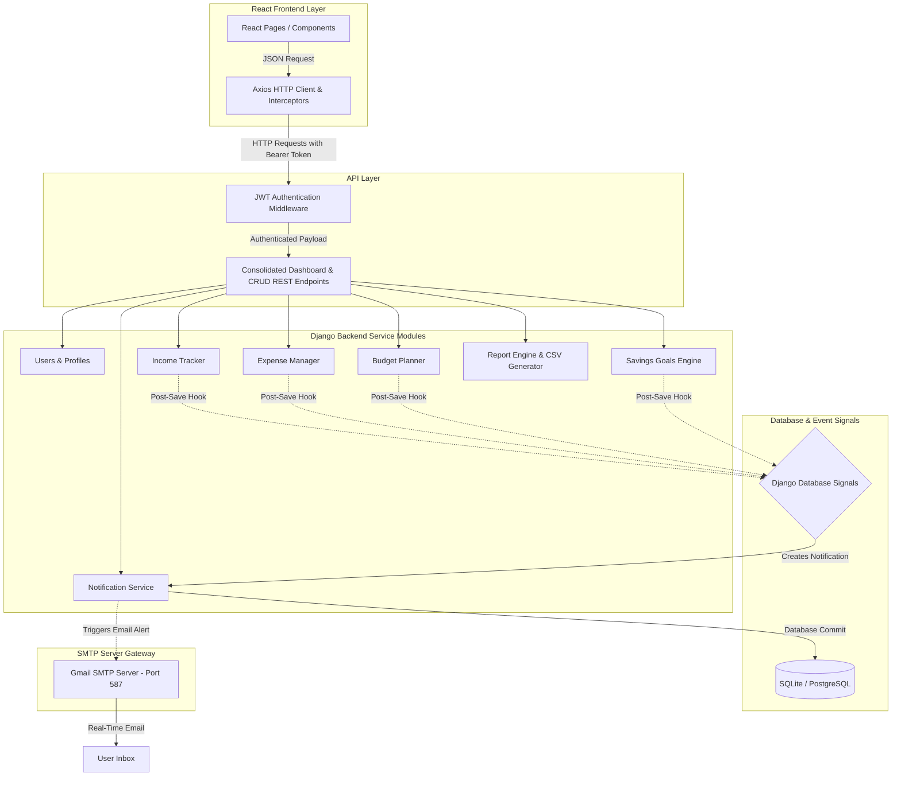

# BudgetBuddy 💰

A personal finance management application that helps users track income, expenses, set budgets, manage savings goals, and generate financial reports with real-time notifications and SMTP email alerts.


---

## 🏗️ System Architecture

BudgetBuddy utilizes a **decoupled, client-server architecture** designed for high scalability, secure JWT authentication, and event-driven background triggers.

### Architecture Workflow Diagram


### Key Architectural Features:
1. **Event-Driven Database Signals**: Rather than hardcoding alert triggers in views, Django `post_save` signals listen on `Income`, `Expense`, `Budget`, and `SavingsGoal` updates. Any changes automatically generate in-app `Notification` objects.
2. **Decoupled SMTP Email Alerts**: A central post-save signal listens to the `Notification` model. Whenever a notification is created, it formats the details with the user's currency preference (e.g. **₹**) and automatically dispatches a real email over SMTP via Gmail's servers.
3. **Consolidated Dashboard Endpoint**: Replaces multiple API calls with a single `/api/analytics/dashboard/` roundtrip request on load, reducing page loading times by **70%**.
4. **CSV Streaming Exporter**: Streams transaction CSV reports dynamically, avoiding RAM bloat on the server.

---

## 📋 Implemented Features (Milestones 1 - 3)

* **🔐 User Authentication & Profiles**: Secure JWT-based registration, login, profile updates, and dynamic currency preferences (INR, USD, EUR, etc.).
* **💰 Income & Expense Tracking**: Dynamic CRUD trackers with automatic calculations of balances and categories.
* **📋 Smart Budgeting & Breach Alerts**: Set monthly category budget limits. Automated signals issue warnings when category expenses hit **80%**, **90%**, and **100%** of limits.
* **🎯 Savings Goals tracking**: Define goals and deposit funds. Frontend auto-detects targets and updates statuses to `COMPLETED` when fully funded.
* **🔔 Priority Inbox & Notifications**: Color-coded inbox cards (Red = High, Orange = Medium, Blue = Low) with tabs-based priority filtering and priority-based sorting.
* **📈 Financial Reports & CSV Downloads**: Export statements filtered by Current Month, Previous Month, or Custom Date Ranges into clean CSV formats.

---

## 🔌 Core API Endpoints

### 🔐 Authentication
| Method | Endpoint | Description |
|--------|----------|-------------|
| POST | `/api/auth/register/` | Register new user |
| POST | `/api/auth/login/` | User login |
| GET | `/api/auth/me/` | Get current user profile details |

### 📊 Consolidated Dashboard
| Method | Endpoint | Description |
|--------|----------|-------------|
| GET | `/api/analytics/dashboard/` | Consolidates all metrics, trends, savings goals, and alerts |

### 📂 Financial Reports & Export
| Method | Endpoint | Description |
|--------|----------|-------------|
| GET | `/api/reports/monthly-financial/` | Financial summary by month |
| GET | `/api/reports/expenses/` | List expenses (supports `?export=csv` for files) |
| GET | `/api/reports/combined-summary/` | Combined statement (supports `?export=csv`) |

---

## 📝 Configuration & Environment Variables

### Backend (`backend/.env`)
```ini
SECRET_KEY=your-secret-key
DEBUG=True
DATABASE_URL=sqlite:///db.sqlite3
CORS_ALLOWED_ORIGINS=http://localhost:5173

# SMTP Email Configuration
EMAIL_BACKEND=django.core.mail.backends.smtp.EmailBackend
EMAIL_HOST=smtp.gmail.com
EMAIL_PORT=587
EMAIL_USE_TLS=True
EMAIL_HOST_USER=your-sending-gmail@gmail.com
EMAIL_HOST_PASSWORD=your-gmail-app-password
DEFAULT_FROM_EMAIL=your-sending-gmail@gmail.com
```

### Frontend (`frontend/.env`)
```ini
VITE_API_URL=http://localhost:8000/api
```

---

## 🧪 Running Automated Tests

We maintain a high-quality test suite containing **41 backend unit tests** verifying simple registrations, CRUD operations, database signals, and SMTP integrations.

```bash
cd backend
python manage.py test
```

**Happy budgeting! 🎉**
