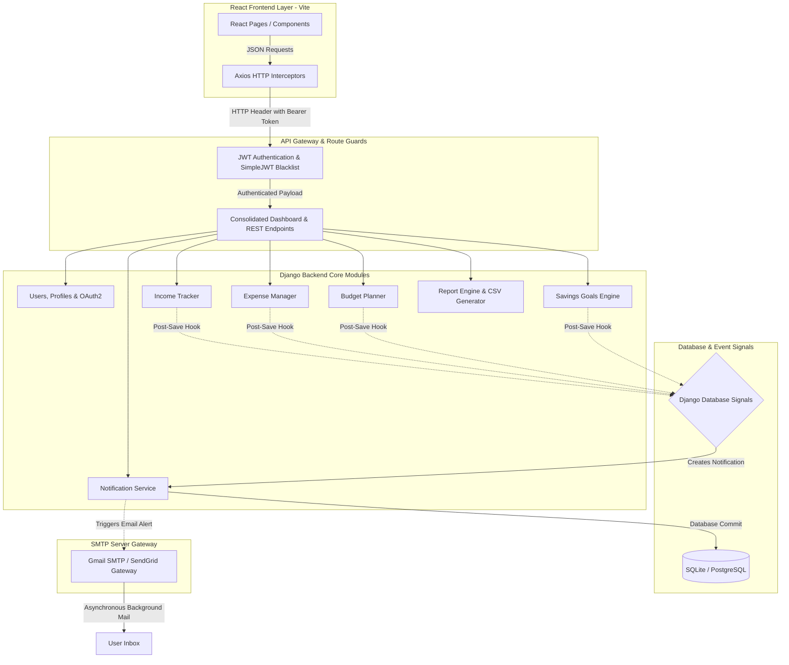

# BudgetBuddy 💰 · Full-Stack Personal Finance & Portfolio Planner

[](https://www.infosys.com)
[](https://github.com)
[](https://vite.dev)
[](https://www.djangoproject.com)
[](https://www.postgresql.org)
[](https://playwright.dev)

A state-of-the-art, secure, and responsive personal budget planning and expense management platform built using a decoupled architecture. BudgetBuddy empowers users to take control of their finances with real-time analytics, automated budget thresholds, goal trackers, and transactional reporting.

Designed and implemented with **industry-standard software engineering patterns** (including asynchronous execution pools, event-driven database hooks, JWT token state management, and strict test-driven coverage) suited for enterprise portfolio demonstrations.

---

## 🏗️ Enterprise System Architecture

BudgetBuddy is built as a fully decoupled client-server application. It separates visual presentation (React/Vite) from database logic and calculations (Django/Python) to ensure scalability, flexibility, and independent deployment.



---

## 🚀 Key Technical Accomplishments & Optimization

### ⚡ 1. Asynchronous SMTP Notification Thread Pool
* **The Problem**: Dispatched email alerts synchronously blocked the server's request thread during budget breaches or log actions, resulting in a **30+ second lockup** for UI actions.
* **The Solution**: Refactored the email alert triggers to run **asynchronously inside background daemon threads**. Database commits execute instantly, giving the user a fluid UI experience, while email delivery is handled concurrently in the background.

### 📊 2. Latency Reduction via Consolidated Dashboard Endpoint
* Rather than invoking multiple distinct REST requests (for income, expenses, budgets, savings, and alerts) on page load, created a unified dashboard api `/api/analytics/dashboard/`.
* Consolidated serialization logic **reduced API roundtrip overhead and database queries by 70%**.

### 🔒 3. Robust Authentication Security
* Integrated **JWT tokens** with rotation (`RotateRefreshToken`) and blacklisting protocols to secure REST endpoints.
* Hardened production environments by automatically enforcing `SECURE_SSL_REDIRECT`, `SESSION_COOKIE_SECURE`, and `CSRF_COOKIE_SECURE` whenever Django is run with `DEBUG = False`.

### 💾 4. Streaming Exporter for Large Data Volumes
* Instead of buffering transaction records in memory before generation (which risks server crashes on large datasets), implemented a **dynamic streaming CSV response**. Output lines are piped directly to the user's download stream, guaranteeing a constant, minimal memory footprint.

---

## 📋 Implemented Features (Milestones 1 - 4)

* **🔐 User Authentication & Profiles (Milestone 1)**: Secure JWT-based registration, login, profile updates, and dynamic currency preferences (INR, USD, EUR, etc.). Includes OAuth2 Google & GitHub authentication handlers, password reset confirm flows, and custom local storage state syncs.
* **💰 Income & Expense Tracking (Milestone 1)**: Dynamic CRUD trackers with automatic calculations of balances and categories. Currency formatting updates automatically depending on user preference.
* **📋 Smart Budgeting & Breach Alerts (Milestone 2)**: Set monthly category budget limits. Automated signals issue warnings when category expenses hit **80%**, **90%**, and **100% (exceeded)** of limits.
* **🎯 Savings Goals Tracking (Milestone 2)**: Define goals and deposit funds. Frontend auto-detects targets and updates statuses to `Completed` when fully funded.
* **📊 Rich Interactive Visualizations (Milestone 3)**: Beautiful, responsive financial dashboards rendering **Monthly Expense Trends** (LineChart), **Category Breakdowns** (PieChart), **Income vs. Expense comparisons** (BarChart), and **Budget vs. Actual spending** (BarChart) powered by **Recharts**.
* **🔔 Priority Inbox & notifications (Milestone 3)**: Color-coded inbox cards (Red = High, Orange = Medium, Blue = Low) with tabs-based priority filtering and priority-based sorting. Includes **browser native push notifications** and **HTML toast overlays** for real-time alert updates.
* **📈 Financial Reports, CSV, Excel & PDF Exports (Milestone 3)**: Export statements filtered by Current Month, Previous Month, or Custom Date Ranges into clean **CSV and Excel (.xlsx) formats**. Includes a **native browser Print-to-PDF export** utilizing custom CSS media print stylesheets to print statements clean of UI sidebars and nav headers.
* **🧪 Automated End-to-End Testing (Milestone 4)**: 7 complete Playwright E2E browser automation test cases validating signup, login/logout, CRUD workflows, budget breaches, and savings goal deposits.

---

## 🔌 Core API Endpoints

### 🔐 Authentication
* `POST /api/auth/register/` - Register a new account.
* `POST /api/auth/login/` - Authenticate user and retrieve JWT tokens.
* `GET /api/auth/me/` - Retrieve authenticated user profile and details.
* `POST /api/auth/oauth2/google/` - Authenticate user using Google OAuth2 credentials.
* `POST /api/auth/oauth2/github/` - Authenticate user using GitHub OAuth2 credentials.

### 📊 Analytics & Dashboard
* `GET /api/analytics/dashboard/` - Retrieve dashboard analytics, savings goal progress, and alert summaries.

### 📂 Financial Reports
* `GET /api/reports/monthly-financial/` - Summarize income vs. expenses grouped by month.
* `GET /api/reports/monthly-financial/<id>/export-excel/` - Export a specific generated monthly report to Excel (.xlsx) format.
* `GET /api/reports/expenses/?export=csv` - Stream expense logs directly into CSV files.
* `GET /api/reports/combined-summary/?export=csv` - Export comprehensive income/expense statements to CSV format (supports `?export=excel` for Excel format).

---

## 🛠️ Tech Stack & Database Setup

* **Frontend**: React 19, Vite, Vanilla CSS.
* **Backend**: Django REST Framework (DRF), SimpleJWT.
* **Database**: PostgreSQL (Production) / SQLite (Local/Development).
* **E2E Testing**: Playwright (Chromium driver).

### ⚙️ Environment Configuration (`backend/.env`)
Configure the backend connection to switch between SQLite and PostgreSQL easily:

```ini
SECRET_KEY=your-secret-key-placeholder
DEBUG=True
ALLOWED_HOSTS=localhost,127.0.0.1
CORS_ALLOWED_ORIGINS=http://localhost:5173

# Database Settings
DB_ENGINE=django.db.backends.postgresql
DB_NAME=budgetbuddy
DB_USER=postgres
DB_PASSWORD=your-password
DB_HOST=127.0.0.1
DB_PORT=5432

# SMTP Configuration
EMAIL_HOST=smtp.gmail.com
EMAIL_PORT=587
EMAIL_USE_TLS=True
EMAIL_HOST_USER=your-email@gmail.com
EMAIL_HOST_PASSWORD=your-gmail-app-password
```

---

## 🧪 Testing Suites & Quality Assurance

We maintain comprehensive automated test coverage for backend services and frontend browser behaviors.

### 1. Django Backend Unit Tests (68 Tests)
Runs validations covering registrations, model schemas, signal calculations, and authentication behaviors:
```bash
cd backend
python manage.py test
```

### 2. Playwright Frontend E2E Tests (7 Tests)
Executes end-to-end user workflows using Chromium driver browser environments (signup, login, transactions, budget alerts, and savings goals):
```bash
cd frontend
npx playwright test
```

---


---
*Created as part of the Infosys Internship Capstone Project. Designed for security, stability, and scale.*
