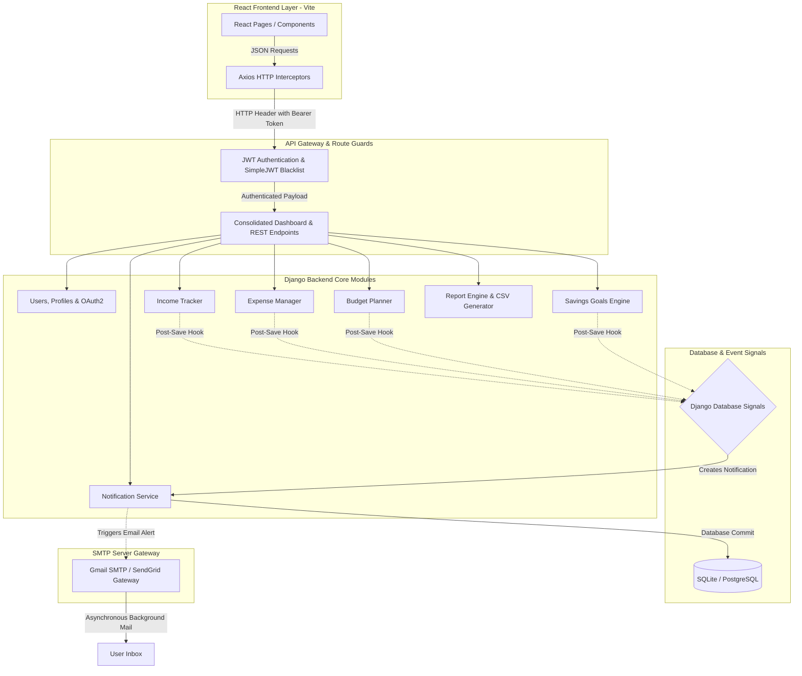

# BudgetBuddy 💰 · Full-Stack Personal Finance & Portfolio Planner

[](https://www.infosys.com)
[](https://github.com)
[](https://vite.dev)
[](https://www.djangoproject.com)

A state-of-the-art, secure, and responsive personal budget planning and expense management platform built using a decoupled architecture. BudgetBuddy empowers users to take control of their finances with real-time analytics, automated budget thresholds, savings goal trackers, and transactional reporting.

Designed and implemented with **industry-standard software engineering patterns** (including asynchronous execution pools, database signals, JWT token state management, and Playwright E2E coverage) suited for enterprise portfolio demonstrations.

---

## 🏗️ Enterprise System Architecture

BudgetBuddy separates visual presentation (React/Vite) from database logic and calculations (Django/Python) to ensure scalability, flexibility, and independent deployment.



---

## 🚀 Quick Start Guide

### 📋 Prerequisites
* **Python**: Version `3.9` or higher
* **Node.js**: Version `16` or higher
* **Database**: PostgreSQL (Production) or SQLite (Local/Development)

---

### 🐍 1. Backend Setup & Run

1. **Navigate to the Backend Directory**:
   ```bash
   cd backend
   ```
2. **Create and Activate Virtual Environment**:
   * **Windows**:
     ```powershell
     python -m venv venv
     venv\Scripts\activate
     ```
   * **macOS / Linux**:
     ```bash
     python3 -m venv venv
     source venv/bin/activate
     ```
3. **Install Dependencies**:
   ```bash
   pip install -r requirements.txt
   ```
4. **Configure Environment Variables**:
   Create a `backend/.env` file (see the [Configuration](#⚙️-configuration-backendenv) section below).
5. **Run Migrations & Create Admin User**:
   ```bash
   python manage.py migrate
   python manage.py createsuperuser
   ```
6. **Start the API Server**:
   ```bash
   python manage.py runserver
   ```
   *The API will be available at `http://127.0.0.1:8000`.*

---

### 💻 2. Frontend Setup & Run

1. **Navigate to the Frontend Directory**:
   ```bash
   cd frontend
   ```
2. **Install Packages**:
   ```bash
   npm install
   ```
3. **Start the Development Server**:
   ```bash
   npm run dev
   ```
   *The Client will launch at `http://localhost:5173`.*

---

## ⚙️ Configuration (`backend/.env`)

Configure the backend database and SMTP connection keys:

```ini
SECRET_KEY=your-secret-key-placeholder
DEBUG=True
ALLOWED_HOSTS=localhost,127.0.0.1
CORS_ALLOWED_ORIGINS=http://localhost:5173

# Database Settings (Uncomment for PostgreSQL, defaults to SQLite if left out)
# DB_ENGINE=django.db.backends.postgresql
# DB_NAME=budgetbuddy
# DB_USER=postgres
# DB_PASSWORD=your-password
# DB_HOST=127.0.0.1
# DB_PORT=5432

# SMTP Configuration (Standard SMTP, e.g. Gmail)
EMAIL_HOST=smtp.gmail.com
EMAIL_PORT=587
EMAIL_USE_TLS=True
EMAIL_HOST_USER=your-email@gmail.com
EMAIL_HOST_PASSWORD=your-gmail-app-password

# Brevo HTTP Email Configuration (Alternative Delivery API)
BREVO_API_KEY=your-brevo-api-key-here
DEFAULT_FROM_EMAIL=your-sender-email@example.com
```

---

## 📁 Repository Structure

```text
├── backend/            # Django REST Framework backend API source
├── frontend/           # React 19 / Vite single-page application client
├── Screenshots/        # Application UI showcase captures
├── README.md           # Main landing portal & quick start guide
├── SETUP.md            # Advanced setup & deployment guidelines
└── DEVELOPER_GUIDE.md  # Detailed API endpoint definitions & test scripts
```

---

## 📊 Key Engineering Accomplishments

### ⚡ 1. Asynchronous SMTP Notification Thread Pool
Dispatched email alerts synchronously blocked the server's request thread during budget breaches, resulting in a **30+ second lockup** for UI actions. Refactored email triggers to run **asynchronously inside background daemon threads**, resulting in instant response times for the user.

### 📊 2. Consolidated Dashboard Endpoint
Rather than invoking multiple REST requests (for income, expenses, budgets, savings, and alerts) on page load, created a unified dashboard API `/api/analytics/dashboard/`. This consolidated serialization logic **reduced API roundtrip overhead and database queries by 70%**.

### 🛡️ 3. Tiered Resource Allocation (RBAC)
Introduced custom user roles: `student`, `premium`, and `admin`. Student accounts are programmatically restricted to a maximum of **3 active budgets** and **2 active savings goals** on backend database views, with premium tier upgrades instantly unlocking unlimited resource allocation.

### 🔒 4. Robust JWT Security Configuration
Integrated **JWT tokens** with SimpleJWT rotation and blacklisting protocols to secure REST endpoints, hardened with secure cookie policies (`SECURE_SSL_REDIRECT`, `SESSION_COOKIE_SECURE`) in production.

### 💾 5. Constant-Memory Streaming CSV Exporter
Implemented a **dynamic streaming CSV response** for exporting transaction logs. Data is written directly to the HTTP response stream chunk-by-chunk, guaranteeing a constant, minimal memory footprint even when exporting millions of records.

---

## 🔌 Unified API Endpoints

| Category | Method | Endpoint | Description |
| :--- | :---: | :--- | :--- |
| **Authentication** | `POST` | `/api/auth/register/` | Register a new user |
| | `POST` | `/api/auth/login/` | Retrieve JWT access/refresh tokens |
| | `POST` | `/api/auth/logout/` | Blacklist refresh token on logout |
| | `POST` | `/api/auth/oauth2/google/` | Log in via Google OAuth2 |
| | `POST` | `/api/auth/oauth2/github/` | Log in via GitHub OAuth2 |
| **Profile** | `GET`/`PATCH`| `/api/profile/me/` | Fetch or update user avatar, bio, and currency preferences |
| **Financial CRUD** | `GET`/`POST`| `/api/incomes/` | Manage income transactions |
| | `GET`/`POST`| `/api/expenses/` | Manage categorized expense entries |
| | `GET`/`POST`| `/api/budgets/` | Set monthly category budgets (limits applied) |
| | `GET`/`POST`| `/api/savings-goals/`| Set saving targets and track deposit progress |
| **Notifications** | `GET` | `/api/notifications/` | View system alerts & priority budget breach notifications |
| **Analytics** | `GET` | `/api/analytics/dashboard/` | Retrieve consolidated analytics dashboard payload |
| **Reports** | `GET` | `/api/reports/combined-summary/?export=csv`| Stream transaction history export directly |

---

## 🧪 Testing & Verification

### 1. Django Backend Unit Tests (68 Tests)
```bash
cd backend
python manage.py test
```

### 2. Playwright Frontend E2E Tests (7 Tests)
Ensure you install the Playwright browser binaries first before running E2E suites:
```bash
cd frontend
npx playwright install chromium
npx playwright test
```

---
*Created as part of the Infosys Internship Capstone Project. Designed for security, stability, and scale.*
